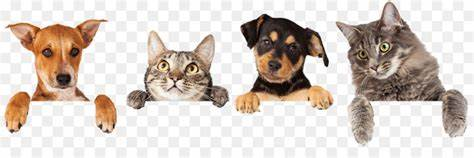

# Projeto Final Imersão JavaScript - Reprograma 
Projeto final desenvolvido durante a ultima semana do curso de JavaScript avançado da @reprograma

## Proposta

Sistema simples com intuito de auxiliar na adoção de animais. 

## Objetivo

A aplicação é um **MVP**  e tem como objetivo listar os animais disponíveis para adoção, trazendo suas principais informações.  

## 🛠️ Para rodar e ver funcionando a aplicação:

* Clonar o projeto na sua máquina
* Para instalar as dependências:    

        npm install

* Instale readline-sync na pasta raiz: 

        npm install readline-sync

* Entre na pasta src e em seguida rode a aplicação com seguinte comando:

        node main.js

    ⚠️ Para verificar todos os testes que foram feitos, rodar o comando:
        

        npm run test

## 🚧 Projeto precisando de algumas melhorias 🚧

 ### Implementações futuras
* Criar uma interface 
* Login 
* Perfil do Adotante
* Incluir formulário para resgate de animais 

## Tecnologias utilizadas
* 
        JavaScript
* 
        Jest 
*       NodeJs

*       Redline-Sync

#### Feito com **<3** | Dezembro de 2022
